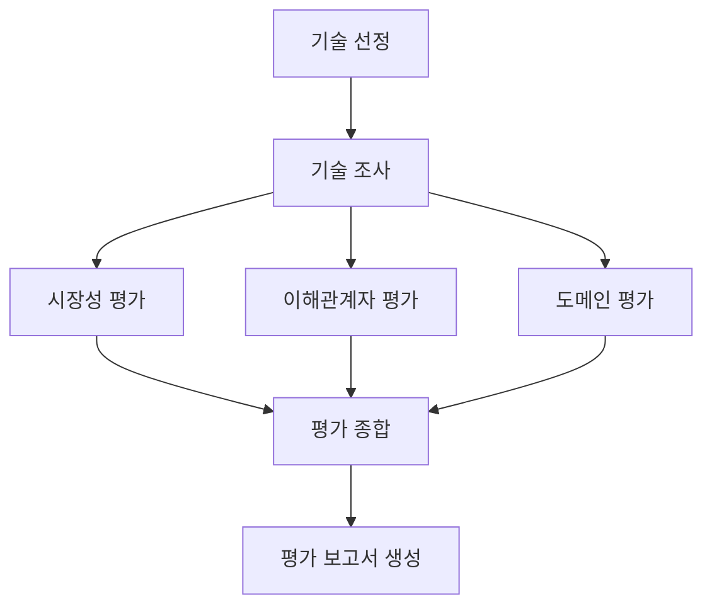

# Subject

본 프로젝트는 KV cache 최적화 기술을 소프트웨어, 하드웨어 두 진영에서 선정하여,
기술 성숙도·시장·이해관계자·도메인 관점에서 비교 평가하는 Agentic RAG를 개발하는 프로젝트입니다.

> 현재 상태: 과제 가이드의 예시 README를 바탕으로 작성한 초기 문서입니다.
> 기술 선정, 설계 및 구현은 아직 진행 전이며, 아래 `TODO` 항목은 팀 논의와 구현 결과로 갱신합니다.

## Overview

- Objective: KV cache 최적화 기술을 복수 관점에서 중립적으로 비교 평가
- Method: LangGraph 기반 Multi-Agent + Agentic RAG
- Tools: TODO — 문서 검색, 외부 정보 검색 및 요약 도구 정의
- 과제 가이드: [KV cache 최적화 기술 평가](https://actually-war-1ea.notion.site/KV-cache-3ba7f4c866938099b7a8fdaa1831c07e)

## Selected Technologies

- SW: TODO — 선정 기술 및 선정 이유
- HW: TODO — 선정 기술 및 선정 이유
- 기술 선정 방식: TODO — 조 직접 선정 또는 에이전트 기반 선정
- 적용 도메인: TODO — 비교 대상으로 삼을 서비스 환경 정의

## Features

아래는 구현 예정 기능입니다.

- PDF 자료 기반 기술 정보 추출 및 근거 검색
- 외부 정보 검색을 통한 시장성·채택 현황·이해관계자 반응 조사
- 기술 성숙도(TRL), 시장성, 이해관계자, 도메인 적용 관점별 평가
- 관점 간 일치·상충 지점을 포함한 비교 보고서 생성
- 실제 사용한 자료의 출처와 공개 정보 기반 추정의 한계 명시
- 확증편향 방지 전략: TODO — 출처 균형, 반대 근거 확인 및 검증 절차 정의

## Tech Stack

- Framework: LangGraph
- LLM/Generator: TODO — GPT 모델 및 선택 이유
- LLM/Judge: TODO — 모델 및 평가 방식
- Retrieval: TODO — VectorDB, 검색 전략, Hit Rate@K 및 MRR 평가 결과
- Embedding: TODO — 오픈소스 임베딩 모델, 비교 후보 및 최종 선택 근거

## Agents

아래 역할은 과제 가이드의 제안이며, 팀 설계에 따라 조정합니다.

| Agent | 역할 | RAG 적용 계획 |
| --- | --- | --- |
| 기술 조사 | 선정 기술의 원문에서 개요·실험 조건·한계 추출 | TODO |
| 시장 평가 | 시장성·상용화·채택 현황 조사 | TODO |
| 이해관계자 평가 | 경쟁 진영·개발자·도입 기업·투자 업계의 반응 조사 | TODO |
| 도메인 평가 | 선택한 적용 환경에서 적합성과 제약 평가 | TODO |
| 평가 종합 | 관점별 결과의 일치·불일치 및 시사점 정리 | TODO |
| 보고서 생성 | 평가 결과와 근거를 연결하여 보고서 작성 | TODO |

기술 조사·시장 평가·도메인 평가 중 최소 1개 에이전트에는 RAG를 적용합니다.

## Architecture

TODO — 확정한 State 설계표 및 실제 구현과 일치하는 그래프를 추가합니다.

아래는 과제 가이드의 참고 흐름입니다. 아직 구현된 구조가 아닙니다.



## Directory Structure

아래는 예정 구조입니다. 현재 저장소에는 README.md와 .gitignore만 포함되어 있습니다.

```text
├── data/                  # 문서 풀 (총 200페이지 이내, 원문은 기본적으로 Git 제외)
├── agents/                # Agent 모듈
├── prompts/               # 프롬프트 템플릿
├── outputs/               # 생성된 평가 결과 (기본적으로 Git 제외)
├── app.py                 # 실행 스크립트
└── README.md
```

## Usage

현재는 문서 초기화 단계이므로 실행 가능한 프로그램은 없습니다.
구현 후 환경 설치, 필요한 환경변수, 자료 준비 및 실제 실행 절차를 작성합니다.

예정 실행 방식:

```bash
python app.py
```

## Contributors

개인별 실제 수행 역할을 기재합니다. 과제 지침에 따라 PM·PL 역할은 포함하지 않습니다.

- TODO — 이름: 실제 수행 역할 (예: PDF Parsing, Retrieval Agent)
- TODO — 이름: 실제 수행 역할 (예: Prompt Engineering, Agent Design)

## Deliverables

- 설계 PDF: `RAG-Design_{캠퍼스}-{X반}_{이름1+이름2+...}.pdf`
  - 기술 선정 및 이유, RAG 적용 대상, 임베딩 선택 근거
  - 도메인·4가지 관점별 평가 기준, State 설계표, Mermaid 그래프, 보고서 목차
  - 제출: DAY 3 오전 10시까지, 반별 Slack 제출 스레드
- 개발 결과: GitHub 링크 + 평가 보고서 PDF
  - 보고서 파일명: `RAG-Output_{캠퍼스}_{X반}_{이름1+이름2+...}.pdf`
  - 제출: DAY 3 오후 4시까지, 반별 Slack 제출 스레드
- 발표: README를 사용한 조별 10분 발표
  - 설계·개발 차별점, 보고서 핵심 포인트, Lessons Learned 포함

보고서는 SUMMARY로 시작하고 REFERENCE로 끝납니다.
SUMMARY는 반 페이지 이내로 작성하고, REFERENCE에는 실제 활용한 자료만 기재합니다.
최종 일정과 제출 위치는 반별 공지를 확인합니다.
