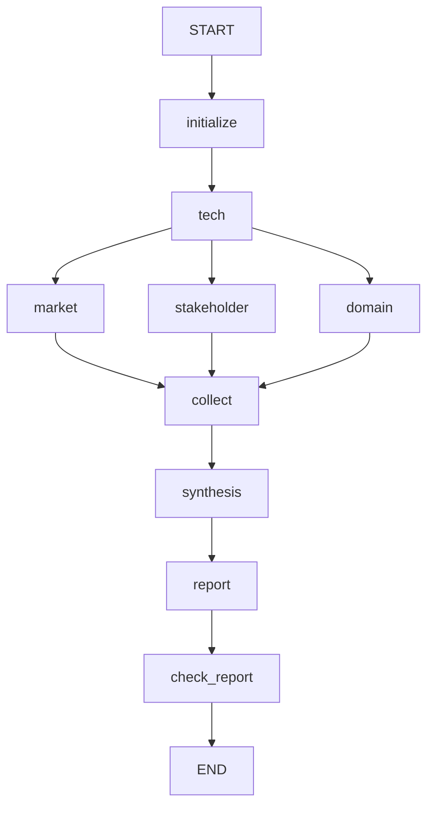

# Subject

KIVI(SW)와 ITME(HW)를 데이터센터·클라우드 LLM 서빙 관점에서 비교하는 Agentic RAG 프로젝트입니다.
현재는 **5명이 공통 파이프라인 위에서 담당 노드의 프롬프트·평가 기준·입력을 개발하는 기초 환경**입니다.
설계서 정합성 계약 v2와 보고서 PDF 출력까지 구현했습니다. 실제 기술 평가·검색 품질 실측·제출 검수는 아직 완료되지 않았습니다.
팀원은 먼저 [변경사항과 브랜치 이관 안내](docs/design-alignment.md)를 읽어주세요.

## Overview

- 공통 기반: Python 3.11, uv, LangGraph, Pydantic, Jinja2, LangSmith
- 개인 작업: `prompts/<node>/`, `rubrics/<node>.yaml`, `tests/fixtures/<node>/`
- 키 없이 연결을 확인하는 mock / 고정 근거로 실제 LLM을 호출하는 fixture / 실제 검색 모드
- [과제 가이드](https://actually-war-1ea.notion.site/KV-cache-3ba7f4c866938099b7a8fdaa1831c07e)
- [팀원 시작 안내](docs/onboarding.md) · [입출력 계약](docs/contracts.md) · [구조와 구현 범위](docs/architecture.md)
- [역할·연결·완료 기준](docs/team-contract.md) · [최종 설계와 구현 차이](docs/final-design-review.md)
- 노드별 회귀 사례: [기술 TRL](docs/tech-trl-evaluation.md) · [평가 종합](docs/synthesis-evaluation.md)

## Selected Technologies

- SW: [KIVI](https://arxiv.org/abs/2402.02750v2) — KV cache 양자화
- HW: [ITME](https://arxiv.org/abs/2606.12556v2) — CXL 기반 계층형 메모리 확장
- 도메인: 데이터센터·클라우드 LLM 서빙
- 서로 다른 접근의 적용 조건을 비교합니다. 서로 다른 실험의 처리량 수치를 직접 우열로 해석하지 않습니다.

## Usage

main에 공통 기초 환경이 반영되어 있습니다.

```bash
git clone https://github.com/dh610/kv-cache-agentic-rag.git
cd kv-cache-agentic-rag
uv sync --frozen
cp .env.example .env
uv run python -m app.run_node --node tech --mode mock
uv run python -m app.run_pipeline --mode mock
uv run pytest -q
```

기본 설치에는 GPU, 모델 다운로드, API 키가 필요하지 않습니다.
mock은 고정 문자열로 그래프 연결과 계약을 확인합니다. 프롬프트 품질이나 기술 평가 성능은 측정하지 않습니다.

실제 LLM으로 담당 노드를 테스트하려면 `.env`에 다음을 설정합니다.

```dotenv
OPENAI_API_KEY=개인_LLM_API_키
LANGSMITH_TRACING=true
LANGSMITH_API_KEY=개인_LangSmith_키
LANGSMITH_PROJECT=kv-rag-본인이름-dev
```

```bash
uv run python -m app.run_node --node market --mode fixture
```

LangSmith는 관측 도구이므로 **LangSmith 키만으로 LLM을 호출할 수는 없습니다.**
추적을 켜면 프롬프트, 입력 근거, 출력이 지정한 LangSmith 프로젝트에 기록됩니다.
출력의 trace 링크와 `outputs/local/<실행 ID>/`의 JSON·렌더링된 프롬프트를 비교하세요.
기본 fixture는 짧은 논문 발췌라 시장 채택·도메인 적합성의 `확인 불가`가 정상일 수 있습니다.

| 모드 | 의미 | 필요한 준비 |
| --- | --- | --- |
| node `mock` | 오프라인 연결 확인 | 없음 |
| node `fixture` | 내 `.j2` + 고정 근거 + 실제 Generator/Judge | OpenAI 키, 추적 시 LangSmith 키 |
| node `rag` | BGE-M3 dense + FAISS 검색 + 실제 LLM | 위 준비 + RAG 추가 설치·PDF·인덱스 |
| node `web` | Tavily 원문 검색 + 실제 LLM | OpenAI·Tavily 키 |
| pipeline `live` | 역할별 RAG/웹을 사용하는 전체 그래프 | OpenAI·Tavily 키 + RAG 인덱스 |

로컬 논문 검색:

```bash
# 공유 ZIP의 kivi.pdf, itme.pdf를 data/papers/에 놓습니다.
uv run python -m app.index --check
uv sync --frozen --extra rag
uv run --extra rag python -m app.index
uv run --extra rag python -m app.run_node --node tech --mode rag
# TAVILY_API_KEY를 .env에 추가한 뒤 전체 연결:
uv run --extra rag python -m app.run_pipeline --mode live
```

최초 인덱싱은 대용량 모델을 다운로드하며 CPU에서는 시간이 걸립니다.
문서와 본문 범위는 `data/documents.yaml`, 검색 설정은 `config.yaml`에서 관리합니다.
PDF/설정이 바뀌면 인덱스를 다시 만들어야 합니다. 전체 PDF 페이지 합계는 200 이하로 제한합니다.

실행 종료 코드는 `0=completed`, `2=needs_revision`, `1=failed/설정 오류`입니다.
결과 파일이 만들어졌다는 사실만으로 성공 판정하지 않습니다.

## Agents

| 노드 | 역할 | live 검색 경로 |
| --- | --- | --- |
| `tech` | 원리·성숙도·실험 조건 | 대상 논문 RAG |
| `market` | 수요·채택·진입 장벽 | 논문 RAG + 웹 |
| `stakeholder` | 이해관계자 반응 | 웹 + 경쟁 진영 한정 reference + 상위 근거 |
| `domain` | 클라우드 적용 조건 | 논문 RAG + 웹 |
| `synthesis` | 관점별 일치·상충 종합 | 기존 결과·근거 사용 |
| `report` | 보고서 구성 | 기존 결과·근거 사용 |

## Architecture



조사 노드 내부는 `plan → search → check_sufficiency → write_draft → verify → return_result`이며 `rewrite_query`, `fix`를 포함한 8단계입니다.
실제 검색 모드는 근거 부족 시 질문별 최대 3회(첫 검색 포함) 안에서 재검색합니다.
표현 오류는 최대 1회 수정 후 재검증합니다. 종합 뒤 자동 보완은 기존 사용자 결정대로 제외하고 gaps를 한계점에 남깁니다.

## Directory Structure

```text
app/                 # run_node, run_pipeline, index 실행 명령
schemas/             # 공통 Pydantic 입출력 계약
graph/               # 공유 LangGraph, 병렬 합류, 검증/종료 처리
runtime/             # 설정, .j2 렌더링, LLM/Judge, LangSmith 기록
rag/                 # 공통 검색 인터페이스, PDF/FAISS, 웹 어댑터
prompts/<node>/      # 담당자 system.j2, user.j2
prompts/shared/      # 공통 근거 규칙·Judge
rubrics/<node>.yaml  # 기준 정의·허용 판정: 팀 검토용 초안
tests/fixtures/      # 공유 고정 입력: Git 추적
data/documents.yaml # 문서 메타데이터: Git 추적
data/papers/         # 개인 원문 PDF: Git 제외
outputs/local/      # 개인 실행 결과: Git 제외
.cache/              # 개인 FAISS 인덱스: Git 제외
```

## Tech Stack

- Generator `gpt-4.1-mini`, Judge `gpt-4.1-nano`: 팀 초안의 기본값, `.env`에서 모델 변경 가능
- BGE-M3 **dense만 사용** + 정규화된 벡터의 FAISS 내적 검색
- 선택적 reranker는 `config.yaml`의 `retrieval.rerank`; 아직 품질 우위 미검증
- 30문항 검색 평가 실행기와 미달 대응(청킹·이중언어·learned sparse RRF·리랭커) 제공. [평가셋 준비](data/eval/README.md)와 실제 측정은 별도 작업
- 서비스 검색 기본값은 dense. 실험 결과를 서비스에 적용할 때 설정/검색 어댑터를 검토하고 인덱스를 다시 생성
- TRL 잠정/최종 구조와 근거 검사 제공. 사람이 검증한 TRL 결론이나 성능 수치를 기본값으로 채우지 않음
- 의존성은 `uv.lock`으로 공유, 기본 설치와 `rag` 추가 설치 분리

## Features and Validation

인용 ID, 대상 기술, rubric, 질문 누락, Judge 누락을 검사합니다.
검증되지 않은 주장은 `unverified`에 남기고 실패한 평가를 `확인 불가`로 보류합니다.
Judge는 인용 정합성 보조 도구이며 기준 판정의 타당성은 담당자가 검토해야 합니다.
검증 상태와 별개로 mock 결과를 실제 기술 결론으로 사용하면 안 됩니다.

```bash
uv run ruff check .
uv run ruff format --check .
uv run pytest -q
# 실제 FAISS 저장/조회 경로를 가짜 임베더로 검증 (모델 다운로드 없음):
uv run --with faiss-cpu --with numpy pytest tests/test_index.py -q
```

GitHub Actions는 API 키 없이 동일한 검사와 mock 전체 파이프라인을 실행합니다.
실제 OpenAI/Tavily/LangSmith API 호출 및 BGE 모델의 검색 품질은 개인 설정 후 별도 확인해야 합니다.

## Contributors

| 팀원 | GitHub | 배정 역할 |
| --- | --- | --- |
| 김계원 | [wonn2k](https://github.com/wonn2k) | 기술 평가 (`tech`) |
| 박유진 | [youjin09222](https://github.com/youjin09222) | 이해관계자 평가 (`stakeholder`) |
| 윤동현 | [dh610](https://github.com/dh610) | 로컬 논문 RAG 및 성능 테스트 |
| 인수연 | [1nyeonart](https://github.com/1nyeonart) | 시장성 평가 (`market`) |
| 정재웅 | [Jae-Ung-Jeong](https://github.com/Jae-Ung-Jeong) | 웹 검색 및 서브그래프 |

2026-09-22 팀 역할 배정을 반영했습니다. 담당자별 수정 경로와 공동 검토 파일은 [협업 계약](docs/team-contract.md#4-수정-범위와-역할-분담)을 기준으로 합니다.
`domain`·`synthesis`·`report`의 최종 내용 책임자는 아직 미정이며, 다른 담당자에게 자동 배정하지 않습니다.
협업자 Write 권한은 저장소 초대를 수락하면 활성화됩니다. GitHub의 기여자 통계는 이후 반영된 커밋에 따라 집계됩니다.
공유 코드보다 담당 프롬프트·rubric·fixture를 우선 수정하고 작은 PR로 합칩니다.
**파일 수정 전 개인 작업 브랜치를 준비하고, main에 직접 수정·커밋·push하지 않습니다.**
[충돌을 줄이는 작업 절차](docs/onboarding.md#git-작업-절차)를 따릅니다. 에이전트는 [AGENTS.md](AGENTS.md), [CLAUDE.md](CLAUDE.md)부터 읽습니다.

노드 인수 전에는 `--case acceptance`로 현재 rubric의 모든 항목을 요청하고
`python -m app.check_handoff --node market --result outputs/local/RUN/result.json`으로 누락·더미·출처를 점검합니다.
자세한 명령과 인수/평가 완료의 차이는 [협업 계약](docs/team-contract.md#5-완료-기준)에 있습니다.

## Deliverables

- 설계 PDF: `RAG-Design_{캠퍼스}-{X반}_{이름1+이름2+...}.pdf`
- 개발 결과: GitHub 링크 + `RAG-Output_{캠퍼스}_{X반}_{이름1+이름2+...}.pdf`
- 최종 보고서: SUMMARY로 시작하고 REFERENCE로 종료, 실제 사용한 자료만 기재
- 조별 발표: README로 설계·구현·보고서 핵심 및 Lessons Learned 설명

일정과 제출 위치는 최신 반별 공지를 확인합니다. 전체 실행은 `report.md`, `report.pdf`, `state.json`을 출력합니다.
`state.json`의 `report_check.ready`, `gaps`, `run_status`를 확인하세요. mock 보고서나 자동 생성 파일 자체는 제출 승인/평가 완료가 아닙니다.
최종 제출 파일명으로 정리하기 전 원문·평가 기준·서지·상충 보존을 사람이 검토해야 합니다.
