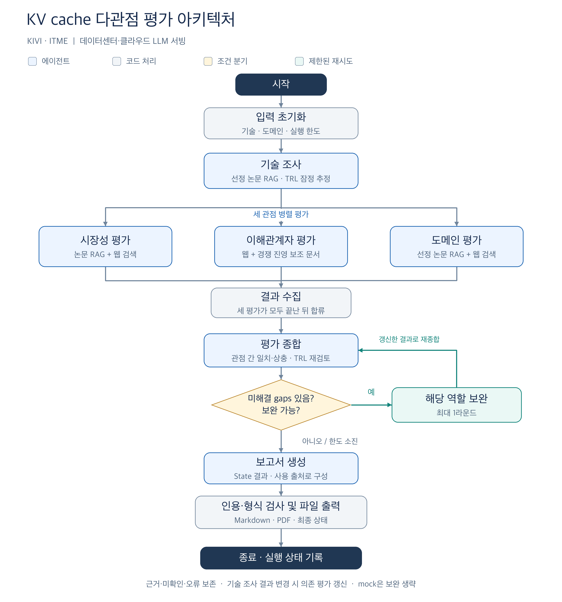
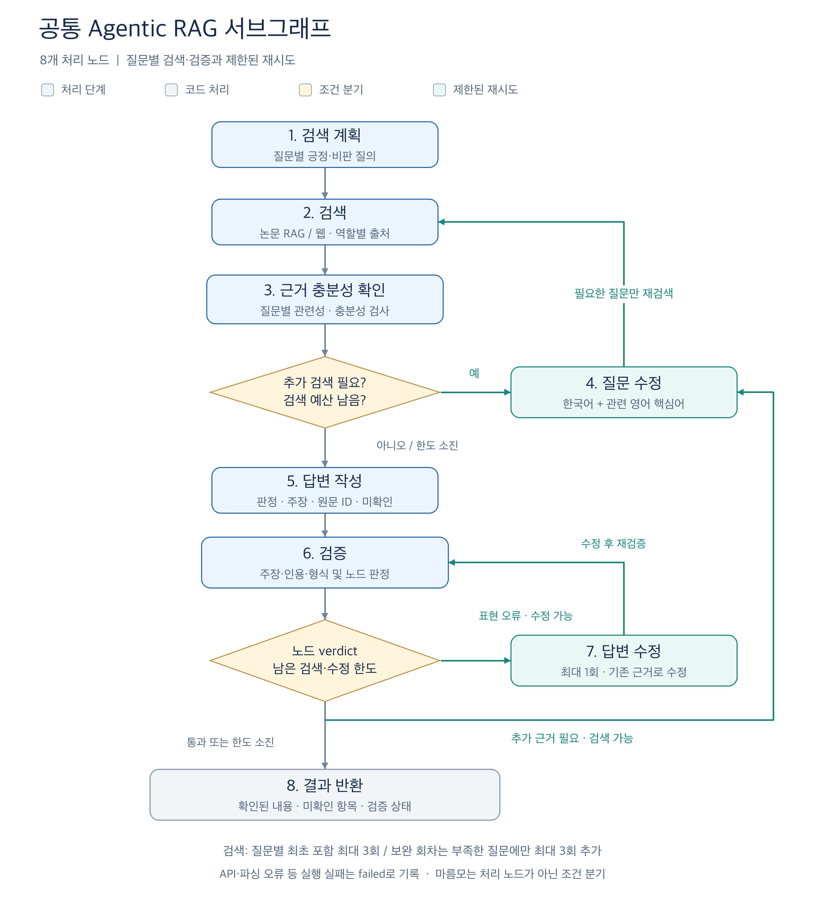

# Subject

KV cache 최적화 기술을 소프트웨어(SW)와 하드웨어(HW) 진영에서 하나씩 선정하고, 시장·이해관계자·도메인 관점에서 비교 평가하는 **Agentic RAG 프로젝트**입니다.

SW의 **KIVI**와 HW의 **ITME**를 대상으로, **데이터센터·클라우드 LLM 서빙** 환경에서 기술의 적용 조건과 관점별 평가 차이를 분석합니다. 기술 조사에서 잠정 추정한 기술 성숙도(TRL)는 평가 종합 단계에서 근거와 함께 재검토합니다. 특정 기술을 추천하거나 종합 순위를 매기기보다 관점 간 일치·상충, 적용 조건, 미확인 사항을 보고서에 남기는 것이 목적입니다.

## Overview

- **Objective**: 같은 기술을 복수 관점에서 평가하고, 두 기술의 평가 결과와 근거를 나란히 비교
- **Method**: Multi-Agent 역할 분리와 병렬 평가 + 검색·충분성 판단·질의 재작성·인용 검증을 수행하는 Agentic RAG
- **Tools**: LangGraph, OpenAI, BGE-M3, FAISS, Tavily
- **Domain**: 데이터센터·클라우드 LLM 서빙
- **Output**: SUMMARY–REFERENCE 구조의 Markdown/PDF 보고서와 실행 상태·근거를 담은 JSON

## Selected Technologies

| 진영 | 선정 기술 | 핵심 접근 | 선정 이유 |
| --- | --- | --- | --- |
| SW | [KIVI](https://arxiv.org/abs/2402.02750v2) | Key는 채널 단위, Value는 토큰 단위로 KV cache를 비대칭 2비트 양자화 | 모델 재학습 없이 KV cache를 압축하는 접근의 대표 사례로, 메모리 절감과 정확도·지원 조건을 함께 평가할 수 있음 |
| HW | [ITME](https://arxiv.org/abs/2606.12556v2) | CXL 하이브리드 메모리와 계층 간 프리페칭을 활용한 저장 공간 확장 | 모델 재학습 없이 메모리 계층을 확장하는 접근의 대표 사례로, 추가 인프라와 데이터 이동·운영 조건을 함께 평가할 수 있음 |

두 기술은 같은 KV cache 병목에 대해 **저장할 데이터를 줄이는 방법**과 **저장 공간을 확장하는 방법**을 비교할 수 있어 선정했습니다. 서로 다른 실험에서 나온 성능 수치를 그대로 우열로 해석하지 않으며, 압축과 메모리 확장의 보완 가능성도 적용 조건과 함께 검토합니다.

설계서 A.4에 따라 시장·이해관계자 평가는 KIVI를 대표로 하는 **KV cache 양자화 접근**, ITME를 대표로 하는 **CXL 메모리를 KV cache 저장 계층으로 사용하는 접근 전반**을 함께 다룹니다. 분야의 시장 전망·채택 사례와 선정 기술 자체의 직접 근거는 구분합니다.

문서 풀은 KIVI·ITME 논문 2편(`target`)과 TurboQuant·InfiniGen 보조 논문 2편(`reference`)으로 구성하며, 전체 200페이지 이내로 관리합니다.

## Features

- **PDF 원문 기반 RAG**: 논문 본문을 청킹·임베딩하고, 기술·문서 역할을 구분해 검색합니다. 주장에 원문 청크 ID와 페이지를 연결합니다.
- **웹 근거 보완**: Tavily 검색으로 시장 전망, 채택·출시, 프레임워크 지원, 이해관계자 반응, 실제 적용 사례의 원문을 수집합니다. 검색 요약문만으로는 근거로 채택하지 않습니다.
- **관점별 평가**: 기술 조사 결과를 참고해 시장성·이해관계자·도메인 평가를 병렬 실행하고, 각 역할의 rubric으로 기술별 판정·이유·근거·미확인 사항을 작성합니다.
- **질문별 Agentic RAG**: 근거 충분성을 판단하고 필요한 질문만 이중언어 질의로 재작성합니다. 최초 검색을 포함해 질문별 최대 3회 검색하고, 답변의 표현·형식 오류는 최대 1회 수정 후 재검증합니다.
- **보완과 종료**: 코드가 계산한 근거 부족 항목(`gaps`)에 따라 종합 뒤 최대 1라운드 보완합니다. 기존 검색 근거·이력을 재사용하며, 부족한 질문에만 추가 검색 예산을 적용합니다. 한도를 소진한 미확인 사항과 실행 오류는 결과에 남깁니다.
- **인용 검증과 보고서 출력**: 주장과 원문의 일치 여부, 인용 ID, 판정 근거, 허용 등급을 검사합니다. 보고서 뒤 인용·형식 검사에서 최종 상태를 판정하고 Markdown/PDF를 출력합니다.
- **확증 편향 방지 전략**: 긍정·비판 질의를 모두 사용하고 검색 이력과 실제 출처의 입장을 구분합니다. 자사·독립·미확인 출처 관계, 선정 기술 직접 근거·분야 배경을 기록하며, 한쪽 자료만 확보된 경우 그 한계를 남기도록 합니다. 관점 간 의견 차이는 보존하고, 의견을 맞추기 위한 재조사는 하지 않습니다.

모든 평가는 **공개 정보 기반 추정**이며, 미확인 사항과 관점 간 상충을 보존합니다. 자동 검증은 사람의 원문·등급 검토를 대체하지 않습니다.

## Tech Stack

| 구분 | 사용 기술·설정 |
| --- | --- |
| Language / Environment | Python 3.11, uv (`uv.lock`으로 의존성 고정) |
| Framework | LangGraph, LangChain OpenAI 연동 |
| LLM / Generator | `gpt-4.1-mini` — 답변 생성·수정 및 검색 계획 |
| LLM / Judge | `gpt-4.1-nano` — 근거 충분성 및 주장·인용 검증 |
| Retrieval | FAISS, 정규화된 dense 벡터의 내적 검색, 기본 Top-K = 5 |
| Retrieval Metrics | **Hit@5·MRR 실측값: 저장소에 확정 결과 미등록**. 사전 통과 기준은 Hit@5 ≥ 0.80, MRR ≥ 0.60이며 실측 성능이 아님 |
| Embedding | 오픈소스 `BAAI/bge-m3` — 기본 서비스 검색에는 dense 임베딩 사용 |
| Chunking | 1,200자, overlap 200자 |
| Web Search | Tavily API — 웹 원문과 URL·수집일 등 출처 메타데이터 |
| Schema / Prompt | Pydantic, Jinja2, 역할별 YAML rubric |
| PDF Input / Output | pypdf / ReportLab |
| Observability | 로컬 실행 기록, LangSmith 연동 지원(선택) |

모델·검색·반복 한도의 기본값은 [config.yaml](config.yaml)에 있습니다. LLM은 환경변수 `GENERATOR_MODEL`, `JUDGE_MODEL`로 변경할 수 있습니다.

검색 평가는 한국어 30문항(기술별 15개, 약어·수치 포함 10개 이상)을 기준으로 BGE-M3, multilingual-e5-large, gte-multilingual-base를 비교하도록 구현했습니다. 기준 미달 시 청킹 → 이중언어 질의 → dense+sparse → 리랭커 순으로 재평가합니다. **기본 리랭커는 꺼져 있으며, 3모델의 실측 비교와 사람 검증 평가셋 완성은 별도 작업입니다.** MRR은 전체 검색 순위 기준으로 MRR@5와 구분합니다.

## Agents

| 에이전트 | 주요 역할·평가 항목 | 자료 경로 |
| --- | --- | --- |
| 기술 조사 (`tech`) | 기술 원리·적용 조건·실험 조건·한계 추출, TRL 잠정 추정 | 선정 기술 논문 RAG |
| 시장성 평가 (`market`) | 시장 규모·성장성, 상용화·채택 현황, 생태계 지지 | 논문 RAG + 웹 검색 |
| 이해관계자 평가 (`stakeholder`) | 경쟁 기술 진영, 도입 기업·개발자, 투자·업계의 반응 | 웹 검색 중심 + 경쟁 기술 진영 질문에 한정한 보조 문서 조회 |
| 도메인 평가 (`domain`) | 비용, 성능, 품질, 도입·운영 난이도, 확장성 | 선정 기술 논문 RAG + 웹 검색 |
| 평가 종합 (`synthesis`) | 관점 간 일치·상충 정리, 근거 대조, 최종 TRL 판단과 조건부 시사점 | 상위 결과·원문 근거 재사용, 새 검색 없음 |
| 보고서 생성 (`report`) | 기술·관점별 비교표, 시사점, 한계점, 사용 출처 구성 | State의 결과·근거 재사용, 새 검색 없음 |

입력 초기화·결과 수집·보완 대상 선택·인용 및 형식 검사는 에이전트와 구분되는 **코드 노드**입니다. 역할별 프롬프트·rubric·질문은 분리하고 공통 서브그래프를 재사용합니다. 시장성은 두 기술 × 3항목, 이해관계자는 두 기술 × 3주체, 도메인은 두 기술 × 5항목을 처리합니다.

## Architecture

전체 그래프는 기술 조사 후 세 관점의 평가를 병렬 실행하고, 모두 완료되면 종합합니다.



보완은 기존 근거·충분성 검사·검색 이력을 재사용합니다. 기술 조사 결과가 바뀐 경우에는 해당 기술에 의존하는 평가도 갱신합니다. 의견 차이 자체는 보완 사유가 아니며, mock 모드에서는 보완을 생략합니다.

공통 서브그래프는 다음 8개 처리 노드로 구성됩니다. 아래 그림의 마름모는 조건 분기입니다.



검색 필요 여부에는 근거 충분성뿐 아니라 긍정·비판 검색 완료 여부도 포함됩니다. 검색 한도는 질문별로 계산하며, 보완 회차에서도 부족한 질문에만 최대 3회를 추가 적용합니다. API·파싱 오류 등 실행 실패는 `failed`로 기록합니다. Main State의 역할별 결과 키는 분리하고 `sources`는 누적 리듀서로 관리해 병렬 결과를 합칩니다.

## Directory Structure

```text
kv-cache-agentic-rag/
├── app/                    # 전체·개별 노드 실행, 인덱싱, 평가 명령
├── graph/                  # 메인 그래프와 공통 8단계 서브그래프
├── rag/                    # 논문 검색, 웹 검색, 근거 병합, 검색 평가
├── runtime/                # LLM 호출, 프롬프트 렌더링, 검증, 보고서 출력
├── schemas/                # 입력·출력·근거·검증 결과의 공통 스키마
├── prompts/                # 역할별 및 공통 Jinja2 프롬프트
├── rubrics/                # 역할별 평가 기준과 허용 등급
├── data/
│   ├── documents.yaml      # 주 문서·보조 문서 메타데이터와 본문 범위
│   ├── paper_downloads.json # 등록 PDF 판본 다운로드 정보
│   ├── source_annotations.yaml # 사람이 확인한 웹 출처 메타데이터
│   ├── papers/             # 로컬 PDF 원문 (Git 제외)
│   └── eval/               # 검색 평가셋 작성·실행 안내
├── tests/                  # 공통 런타임·역할별 테스트와 고정 사례
├── docs/                   # 설계 대응, 팀 계약, 실행·평가 안내
│   └── images/             # README 아키텍처 PNG
├── outputs/local/          # 보고서·JSON·실행 기록 (Git 제외)
├── .cache/                 # 모델·논문 인덱스 등 로컬 캐시 (Git 제외)
├── config.yaml             # 기술·도메인·모델·검색·반복 한도
├── .env.example            # API 키 및 환경변수 설정 예시
├── pyproject.toml          # Python 의존성·도구 설정
├── uv.lock                 # 의존성 잠금 파일
├── run-report.sh           # 환경 준비부터 실제 보고서 생성까지 실행
└── README.md
```

## Usage

### 1. 프로젝트와 API 키 준비

macOS / Linux / WSL의 터미널에서 실행합니다.

```bash
git clone https://github.com/dh610/kv-cache-agentic-rag.git
cd kv-cache-agentic-rag
cp -n .env.example .env
```

`.env`의 `OPENAI_API_KEY`, `TAVILY_API_KEY`에 사용할 키를 입력합니다. 기존 `.env`와 키는 덮어쓰지 않으며, 환경변수로 이미 설정한 값이 있으면 우선 사용합니다. `.env`, 원문 PDF, 모델·인덱스 캐시, 생성 결과는 Git에 올리지 않습니다.

LangSmith 추적은 선택 사항입니다. 사용할 경우 `.env.example`에 따라 개인 프로젝트와 키를 설정합니다. 추적을 켜면 입력·출력이 해당 LangSmith 프로젝트에 기록됩니다.

### 2. 실제 보고서 생성

```bash
./run-report.sh
```

uv·Python 3.11·의존성, 등록 PDF 4편, BGE-M3와 FAISS 인덱스를 준비한 뒤 실제 파이프라인을 실행합니다. 기존 원문과 유효한 인덱스는 재사용합니다. 최초 준비에는 다운로드가 필요하며, 실제 실행은 설정한 OpenAI·Tavily 계정의 API를 사용합니다.

```bash
./run-report.sh --prepare-only  # 논문·모델·인덱스 준비만 수행, 유료 API 호출 없음
./run-report.sh --mock          # 키 없이 고정 자료로 실행 흐름과 파일 출력 점검
```

mock은 실행 흐름을 확인하는 모드이며, 실제 기술 평가나 검색 성능 측정이 아닙니다.

### 3. 결과 확인

실행 후 터미널에 표시된 `outputs/local/<실행 ID>/`에서 확인합니다.

| 파일 | 내용 |
| --- | --- |
| `report.pdf`, `report.md` | SUMMARY → 분석 배경 → 기술 선정 → 기술 개요·TRL → 관점별 평가 → 시사점 → 한계점 → REFERENCE |
| `state.json` | 역할별 결과·근거·미해결 gaps·`run_status`·`report_check` |
| `run.json` | 실행 모드·모델 설정·Git 버전·추적 정보 |
| `preview.md` | 개발용 노드 결과 요약 |

종료 코드는 `0=completed`, `2=needs_revision`, `1=failed/설정 오류`입니다. **PDF 생성 자체가 평가 성공을 뜻하지 않습니다.** `state.json`의 `run_status`, `report_check.ready`, `gaps`를 확인하고, 제출 전 원문·등급·출처를 사람이 검토합니다.

### 4. 개별 노드 및 개발 검증

```bash
uv run python -m app.run_node --node market --mode mock --case acceptance
uv run ruff check .
uv run ruff format --check .
uv run pytest -q
uv run python -m app.run_pipeline --mode mock
```

## Contributors

| 팀원 | GitHub | 담당 역할 |
| --- | --- | --- |
| 김계원 | [wonn2k](https://github.com/wonn2k) | 기술 조사 에이전트, 도메인 조사 에이전트, 도메인 / 기술 프롬프트·rubric·TRL 평가 사례 |
| 박유진 | [youjin09222](https://github.com/youjin09222) | 이해관계자 평가 에이전트, 이해관계자 프롬프트·rubric·평가 사례 |
| 윤동현 | [dh610](https://github.com/dh610) | 논문 RAG, PDF 청킹·임베딩·인덱싱, 검색 성능 평가 |
| 인수연 | [1nyeonart](https://github.com/1nyeonart) | 시장성 평가 에이전트, 시장 프롬프트·rubric·평가 사례 및 검증 |
| 정재웅 | [Jae-Ung-Jeong](https://github.com/Jae-Ung-Jeong) | 웹 검색, 공통 서브그래프와 그래프 연결·검증 |
