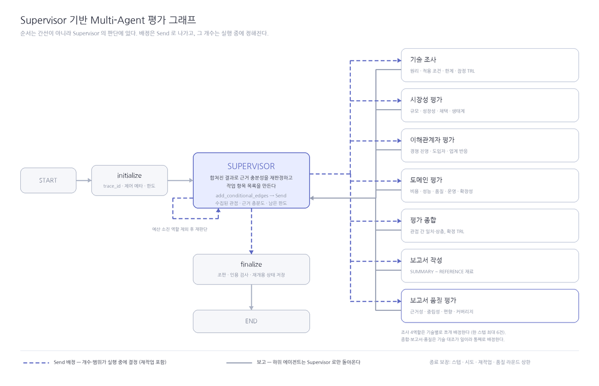

# Subject

본 프로젝트는 KV cache 최적화 기술을 소프트웨어·하드웨어 두 진영에서 선정하여, 기술 성숙도·시장·이해관계자·도메인 관점에서 평가하는 **Supervisor 패턴** 기반으로 설계/개발하는 프로젝트임.

앞선 RAG 과제에서는 같은 목적을 **고정된 순서**(기술 조사 → 세 관점 병렬 → 종합 → 보완 1회 → 보고서)로 수행했다. 이번 과제는 그 순서를 코드에서 걷어내고, **Supervisor가 매 스텝 State를 읽어 다음에 누구를 부를지 결정**하도록 조정 계층을 다시 만든 것이다. 하위 에이전트(검색·평가 로직)는 그대로 재사용한다.

## Overview

- **Objective** : 하나의 기술을 복수 관점에서 비교 평가. 특정 기술을 추천하거나 우열을 판정하지 않는다.
- **Pattern** : **Supervisor** — 이 과제의 병목은 "일이 많은 것"이 아니라 "근거를 못 찾는 것"이다. 평가 대상 2개 × 관점 4개는 고정된 소수이고 관점마다 rubric·프롬프트·근거 정책이 전부 달라서, 사전 계획 후 동적 분할(Orchestrator-Workers)을 해도 매번 같은 분할이 나온다. 반면 시장·이해관계자 근거는 공개 정보 자체가 희소해 **"더 파볼까 / 확인 불가로 남길까"를 반복 판단**해야 한다. 그 판단을 매 스텝 수행하는 것이 Supervisor다.
- **동적 처리** : 고정 순서와 다른 점은 아래 네 가지다.

| 고정 순서(이전) | Supervisor(현재) |
| --- | --- |
| 간선이 순서를 정함 | `add_conditional_edges`가 **State를 읽고** 다음 노드를 고름. 라우팅 함수는 노드 **리스트**를 반환할 수 있어 독립 관점은 한 스텝에 병렬 배정 |
| 보완 재실행이 "종합 뒤 최대 1라운드"로 고정 | **근거 충분성을 판정한 뒤** 부족한 역할에만 재작업 지시. 충분해질 때까지 스텝 수가 가변 |
| 보고서 생성이 마지막 | 보고서 뒤 **품질 평가 노드**가 4항목을 판정하고, 미달이면 책임 에이전트로 되돌림 |
| 실패 시 중단 | 하위 에이전트 실패·예산 소진을 **제외하고 진행**(fall-back)하되 그 사실을 보고서에 남김 |

실행 예 (mock, 8스텝) — 같은 그래프가 State에 따라 다른 경로를 돈다:

```text
[ 1] dispatch   → tech                         기술 조사 결과 없음 — 기술 조사 에이전트 배정
[ 2] rework     → tech                         기술 조사 근거 부족 (충분도 0.5, 미해결 10건) — 재작업
[ 3] dispatch   → market, stakeholder, domain  미수집 관점 — 병렬 배정
[ 4] rework     → market, stakeholder, domain  근거 부족 관점 재작업 — market(0.5), stakeholder(0.5), domain(0.5)
[ 5] synthesize → synthesis                    근거 충분성 판정 완료 / 재작업해도 근거 증가 없음: tech, market, …
[ 6] report     → report                       종합 완료 — 보고서 작성
[ 7] quality    → quality                      보고서 초안 완성 — 품질 평가 수행
[ 8] finalize   → finalize                     품질 미달이나 재작업 예산 없음 — 미달 항목을 남기고 종료
```

## Selected Technologies

| 진영 | 선정 기술 | 핵심 접근 | 선정 이유 |
| --- | --- | --- | --- |
| SW | [KIVI](https://arxiv.org/abs/2402.02750v2) | Key는 채널 단위, Value는 토큰 단위로 KV cache를 비대칭 2비트 양자화 | 모델 재학습 없이 **저장할 데이터를 줄이는** 접근의 대표 사례 |
| HW | [ITME](https://arxiv.org/abs/2606.12556v2) | CXL 하이브리드 메모리와 계층 간 프리페칭으로 메모리 계층 확장 | 모델 재학습 없이 **저장 공간을 넓히는** 접근의 대표 사례 |

같은 KV cache 병목에 대해 정반대 방향으로 접근하면서도 **비교 조건이 같다**(둘 다 재학습 불필요, 기존 서빙 스택에 얹는 방식). 평가 도메인은 두 기술의 차이가 가장 선명하게 갈리는 **데이터센터·클라우드 LLM 서빙**으로 고정했다. 서로 다른 실험에서 나온 성능 수치를 그대로 우열로 해석하지 않으며, 압축과 메모리 확장의 보완 가능성도 적용 조건과 함께 검토한다.

## Features

- **PDF 자료 기반 정보 추출** : KIVI·ITME 논문 2편(`target`)과 TurboQuant·InfiniGen 보조 논문 2편(`reference`)을 청킹·임베딩하고, 주장마다 원문 청크 ID와 페이지를 연결한다.
- **웹 근거 보완** : Tavily로 시장 전망·채택·프레임워크 지원·이해관계자 반응 원문을 수집한다. 검색 요약문만으로는 근거로 채택하지 않는다.
- **동적 라우팅** : Supervisor가 `control` 블록(역할별 상태·시도 횟수·근거 충분도)만 읽고 분기한다. 페이로드를 읽어야 분기할 수 있다면 제어 상태로 승격한다.
- **근거 충분성 평가 → 재작업** : 항목 충족·출처 다양성·양면 검색 3축을 코드 규칙으로 계산하고, 기준 미달 역할에만 **부족 항목을 명시해** 재작업을 지시한다.
- **확증 편향 방지 전략** : ① 긍정·비판 질의를 쌍으로 발행하고 둘 다 수행되지 않은 질문은 충분도에서 감점 ② 기술마다 서로 다른 문서/사이트가 2건 이상인지 검사 ③ 자사(`first_party`)·독립(`independent`) 출처를 분류하고 자사 자료만 있으면 gap으로 기록 ④ 관점 간 의견 차이는 보존하며, 의견을 맞추기 위한 재조사는 하지 않는다.
- **보고서 품질 평가** : 보고서 생성 **후** Groundedness·중립성·편향 통제·관점 커버리지 4항목을 **Hybrid(코드 규칙 + LLM Judge)** 로 판정하고, 미달이면 책임 에이전트로 루프한다.
- **수확 체감 감지** : 재작업했는데 근거가 한 건도 늘지 않은 역할은 다시 재작업하지 않는다. 이 도메인은 공개 정보 자체가 희소해, 같은 질의로 한 번 더 도는 것은 같은 `확인 불가`를 더 비싸게 받아 오는 일이다. **"덜 찾은 것"과 "원래 없는 것"을 구분하는 장치**다.
- **제출 규격 조판** : 같은 평가 결과를 두 가지로 조판한다. 전체본은 산출물 기록용이고, **제출본은 과제 규칙의 10장 한도**에 맞춘다. 압축은 반복만 접는다 — 필수 목차 8개, 비교표 6개, 판정·근거·출처 연결은 양쪽이 같고 품질 평가 결과도 같다. REFERENCE는 절 스스로 정한 규칙("실제로 인용한 자료만")대로 **본문이 인용한 것만** 싣는다(두 번 조판해 번호를 다시 매긴다).
- **Fall-back** : 하위 에이전트가 실패하거나 시도 한도를 소진하면 그 역할을 제외하고 남은 근거로 보고서까지 진행하되, 빈 자리와 사유를 보고서와 `supervisor.json`에 남긴다.

모든 평가는 **공개 정보 기반 추정**이며, 자동 검증은 사람의 원문·등급 검토를 대체하지 않는다.

## Tech Stack

| 구분 | 사용 기술·설정 |
| --- | --- |
| Framework | **LangGraph** (`StateGraph` · `add_conditional_edges` · reducer) |
| LLM / Generator | **gpt-4.1-mini** — 검색 계획, 답변 생성·수정 |
| LLM / Judge | **gpt-4.1-mini** — 근거 충분성, 주장·인용 검증, **보고서 품질 2층 판정** |
| Retrieval | **FAISS** (정규화 dense 내적, Top-K=5) — **Hit@5 0.800 / MRR 0.600** (30문항 실측, 리랭커 없음) |
| Embedding | 오픈소스 **BAAI/bge-m3** — 한국어 질문 × 영어 논문 다국어 검색 |
| Web Search | Tavily API — 원문과 URL·수집일 등 출처 메타데이터 |
| Schema / Prompt | Pydantic, Jinja2, 역할별 YAML rubric |
| Observability | LangSmith 트레이싱 + 로컬 `decisions.jsonl` (`trace_id`로 상관) |

`gpt-4.1-nano`는 "claim 당 check 정확히 1개 · 근거 ID" 규칙을 지키지 못해 Judge에서 제외했다. 모델·한도 기본값은 [config.yaml](config.yaml)에 있고, 실제 실행값은 산출물의 `run.json`에서 확인한다.

## Agents

조정 계층(`agents/`)과 하위 에이전트(`graph/node_graph.py` 공통 서브그래프)를 분리한다. 하위 에이전트는 **Supervisor하고만 통신하며**, 서로를 직접 호출하거나 간선으로 잇지 않는다.

| 에이전트 | 역할 | 평가 항목 |
| --- | --- | --- |
| **Supervisor** (`agents/supervisor.py`) | 매 스텝 제어 상태를 읽어 다음 분기를 고르고, 근거 부족 시 재작업을 지시하며, 종료를 판정 | — |
| 기술 조사 (`tech`) | 원리·적용 전제·실험 조건·한계 추출, TRL 잠정 추정 | mechanism / maturity / limitations |
| 시장성 평가 (`market`) | 시장 규모·성장성, 상용화·채택, 생태계 지지 | growth / adoption / ecosystem |
| 이해관계자 평가 (`stakeholder`) | 경쟁 기술 진영, 도입 기업·개발자, 투자·업계 반응 | competitors / adopters / industry |
| 도메인 평가 (`domain`) | 데이터센터·클라우드 LLM 서빙 적합성 | cost / performance / quality / operations / scalability |
| 평가 종합 (`synthesis`) | 관점 간 일치·상충 정리, 확정 TRL 판단 | consistency / implications |
| 보고서 작성 (`report`) | SUMMARY~REFERENCE 재료 구성 | overview / market / stakeholder / domain / implications |
| **보고서 품질 평가** (`agents/quality.py`) | 생성된 보고서를 4항목으로 판정, 미달 시 책임 에이전트 지정 | groundedness / neutrality / bias_control / coverage |

`initialize` · `finalize`는 에이전트가 아니라 **코드 노드**다. 판단하지 않고 제어 메타 초기화와 조판·검사만 한다.

### 보고서 품질 평가 (가이드 D — 3안 Hybrid)

| 항목 | 1층 코드 규칙 (결정적) | 2층 LLM Judge (내용) |
| --- | --- | --- |
| Groundedness | 보고서 주장의 인용 ID가 실제 출처 목록으로 추적되는 비율 ≥ 0.9, 확인 불가가 아닌 등급은 근거 필수 | 출처에 없는 수치·날짜를 말하거나, 출처의 조건을 떼고 일반화했는가 |
| 중립성 | 추천·우열 표현 사전 검출(`추천한다`, `더 우수`, `앞선다` 등) | 표현을 바꾼 우열 판정, 한쪽 한계만 반복해 결론을 유도했는가 |
| 편향 통제 | 기술당 서로 다른 출처 ≥ 2건, 독립 출처 존재, 긍정·비판 양쪽 원문 확인 | 제안자 자신의 자료에만 기댔는가, 비판 자료가 있는데 긍정만 인용했는가 |
| 관점 커버리지 | 4개 관점의 절 존재 + 해당 관점의 등급 존재 | 절 제목만 있고 내용이 비었는가 |

**AND 결합** — 어느 층에서든 불합격이면 그 항목은 불합격이다. 1층이 떨어뜨린 항목은 2층에 묻지 않는다(결론이 정해졌고 호출만 낭비). Judge를 쓸 수 없는 mock에서는 1층만 돌고 `judge_available=false`로 남겨 **"검사하지 않은 것"과 "통과한 것"을 구분**한다.

미달 시 Supervisor가 책임 소재로 번역해 되돌린다 — 근거 문제(groundedness·편향)는 조사 에이전트, 서술 문제(중립성)는 보고서 에이전트, 커버리지는 비어 있는 관점의 담당자.

## State Schema

`agents/state.py`. 설계 근거는 아래와 같고, 각 항목은 `tests/test_supervisor.py`에서 고정한다.

- **제어 vs 페이로드 분리** : State를 두 블록으로 나눈다. 페이로드는 `results` · `sources` · `trl_result` · `report_text` · `quality`, 제어 메타는 `trace_id` · `step` · `control` · `route` · 각종 한도다. **라우팅 함수는 제어 블록만 읽고 분기한다.** 페이로드를 읽어야 분기할 수 있다면 제어 상태로 승격해야 한다는 뜻이고, 그 승격을 수행하는 곳이 `agents/sufficiency.py`다(`NodeRun` 본문 → `RoleControl` 요약).
- **관측성 위치** : 결정 로그의 **본문**(사유·대상·시각)은 State가 아니라 외부 계층(`agents/observability.py` → `decisions.jsonl`)에 적재한다. State에는 재개 판단에 필요한 최근 40건 요약만 남긴다. 전부를 State에 담으면 체크포인트마다 로그 전체가 복사되고, 전부를 빼면 중단 후 직전 판단을 알 수 없다. **모든 결정은 사유 없이 기록되지 않는다**(`Decision.reason` 필수).
- **지속성 비용** : 근거 원문·검색 이력은 노드가 끝나는 즉시 `<output_dir>/nodes/<role>.json`으로 내보내고, State의 `sources`에는 **실제 인용된** 근거만 올린다. `decisions`는 윈도우(40)로, `control`은 역할당 1건으로 상한이 있다. 종합·보고서가 상속하는 근거도 상위 노드 풀 전체가 아니라 인용된 원문만이다.
- **상관** : `trace_id`·`run_id`가 State · `decisions.jsonl` 모든 줄 · LangSmith 실행 메타데이터에 함께 실린다. 외부 로그 한 줄에서 State의 몇 번째 스텝인지 역추적할 수 있다.
- **재개/복구** : `control[role]`이 역할별 `status` · `attempts` · `last_error` · `sufficiency` · `artifact`(결과 파일 경로)를 들고 있어, 중단 지점에서 "무엇이 끝났고 무엇을 몇 번 시도했는지"를 State만으로 복원한다. 실행이 끝나면 같은 내용을 `supervisor.json`으로 남긴다.
- **동시 처리** : Supervisor가 독립 관점을 한 스텝에 함께 보내므로(`route`가 리스트 반환) `results` · `sources` · `control` · `decisions`가 동시 쓰기 필드이며 **전부 reducer를 갖는다**. 특히 `sources`는 단순 concat이 아니라 ID 단위 병합이다 — concat은 중복 제거가 아니고, 같은 ID의 본문이 상충하면 조용히 덮어쓰는 대신 오류로 드러나야 한다.
- **종료 보장** : 네 겹의 상한을 둔다 — `step`/`max_steps`(24), `RoleControl.attempts`/`max_attempts`(2), `revision_round`/`max_revisions`(2), `quality_round`/`max_quality_rounds`(1). 여기에 **벽시계 예산**(`max_seconds`, 기본 25분)과 **수확 체감 감지**(`stalled`)를 더한다. 뒤의 둘은 재작업만 멈추고 보고서 생성·품질 평가는 계속하므로 **산출물은 반드시 나온다**. 한도를 소진한 종료는 실패가 아니라 "미해결을 남긴 채 종료"이며 사유를 `stop_reason`에 적는다.

## Architecture



이 그림은 **컴파일된 그래프 객체에서 생성**한다(`python -m app.draw_architecture`). 하위 에이전트끼리 간선이 생기면 그림 생성이 실패하므로, 그림과 코드가 어긋날 수 없다.

## Directory Structure

```text
kv-cache-agentic-rag/
├── agents/                 # ★ 조정 계층 (Supervisor 패턴)
│   ├── state.py            #   State 스키마 · reducer · 제어/페이로드 분리
│   ├── supervisor.py       #   동적 라우팅 · 재작업 지시 · 종료 판정
│   ├── sufficiency.py      #   근거 충분성 평가 (페이로드 → 제어 메타 요약)
│   ├── workers.py          #   하위 에이전트 래퍼 (Supervisor와만 통신)
│   ├── quality.py          #   보고서 품질 평가 4항목 (Hybrid)
│   ├── observability.py    #   결정 로그를 State 밖으로 (trace_id 상관)
│   └── report_view.py      #   State → 보고서 조립기 어댑터
├── graph/
│   ├── supervisor_graph.py # ★ Supervisor 메인 그래프
│   ├── main_graph.py       #   이전 고정 순서 그래프 (비교용으로 보존)
│   └── node_graph.py       #   하위 에이전트 공통 서브그래프 (무변경)
├── rag/                    # 논문·웹 검색, 근거 병합, 검색 평가 (무변경)
├── runtime/                # LLM 호출, 프롬프트, 검증, 보고서 조판
├── schemas/contracts.py    # 입출력·근거·검증·품질 판정 공통 스키마
├── prompts/                # 역할별 Jinja2 프롬프트 (+ quality/judge.j2)
├── rubrics/                # 역할별 평가 기준과 허용 등급 (무변경)
├── data/                   # 문서 풀 · 출처 메타데이터 · 검색 평가셋
├── outputs/local/          # 보고서 · 결정 로그 · 실행 기록 (Git 제외)
├── tests/                  # 공통 런타임 + test_supervisor.py (패턴 필수 항목)
├── app/
│   ├── run_supervisor.py   # ★ Supervisor 실행 스크립트
│   ├── run_pipeline.py     #   이전 고정 순서 실행 (비교용)
│   └── draw_architecture.py#   그래프에서 아키텍처 그림 생성
├── config.yaml             # 기술·도메인·모델·검색 + supervisor 한도
└── README.md
```

## Usage

```bash
# 1) 연결 점검 — API 키 없이 그래프·라우팅·품질 평가 루프를 전부 확인
uv run python -m app.run_supervisor --mode mock

# 2) 고정 근거로 실제 LLM 실행 — LangSmith 트레이스가 남는다 (웹 검색 없음, 빠름)
uv run python -m app.run_supervisor --mode fixture

# 3) 실제 조사 — 논문 RAG + 웹 검색 (키 필요, 시간 소요)
uv run --extra rag python -m app.run_supervisor --mode live
```

`.env.example`을 `.env`로 복사해 `OPENAI_API_KEY` · `TAVILY_API_KEY`를 넣는다. 트레이싱은 `LANGSMITH_TRACING=true` + 개인 `LANGSMITH_PROJECT`로 켠다(`mock`은 업로드하지 않는다). 산출물은 `outputs/local/<타임스탬프>-supervisor-<id>/`에 `report.md` · `report.pdf` · `decisions.jsonl` · `supervisor.json` · `nodes/*.json`으로 남는다.

실행 시간이 길어지면 `config.yaml`의 `supervisor.max_seconds`(기본 1500초)가 재작업을 중단시키고 보고서는 그대로 생성한다. 더 짧게 보려면:

```bash
SUPERVISOR_MAX_ATTEMPTS=1 SUPERVISOR_MAX_REVISIONS=0 uv run python -m app.run_supervisor --mode fixture
```

실행 폴더에는 전체본(`report.md` · `report.pdf`)과 **제출본**(`submission/report.pdf`, 10장)이 함께 남는다. 보고서 조판만 고칠 때는 모델을 다시 호출하지 않고 재조판한다:

```bash
uv run python -m app.rerender_report --from outputs/local/<실행 폴더> --compact
```

```bash
uv run python -m pytest          # 전체 테스트
uv run python -m app.draw_architecture   # 아키텍처 그림 재생성
```

## Measurements

같은 입력으로 실측한 값이다. 설정은 모두 [config.yaml](config.yaml)에 있고, 실행 시간은 각 산출물의 `run.json`에 `elapsed_seconds`로 남는다.

| 구성 | 모드 | 시간 |
| --- | --- | --- |
| 이전 고정 순서 + 주장 판정 직렬 | fixture | 372.8초 |
| 이전 고정 순서 + 주장 판정 병렬 | fixture | **240.2초** (−35.6%) |
| Supervisor + 주장 판정 병렬 | fixture | 376.6초 |

주장 판정은 주장마다 독립이라 동시에 돌려도 결과가 같다. fixture에서 Supervisor가 이전과 비슷한 이유는, 병렬화로 번 시간을 **추가로 하는 일**(근거 부족 재작업, 품질 평가)이 쓰기 때문이다.

live에서는 재작업 1라운드가 전체의 56%(28.2분 중 15.9분)를 썼다. 그 라운드가 헛돈 것은 아니고 이해관계자 근거가 173→448건으로 늘었지만, 질문마다 첫 실행과 **같은 검색 예산**을 다시 받는 것이 비용의 대부분이었다. `supervisor.rework_search`로 추가 검색을 1회로 제한하면:

| | 재작업 라운드 | 첫 보고서까지 |
| --- | --- | --- |
| `rework_search` 미설정(=3) | 953초 | 28.1분 |
| `rework_search: 1` | **126초** (−87%) | **12.2분** (−57%) |

근거는 15~19% 줄었고 미해결 항목 수는 거의 같았다(도메인 적용 3건으로 동일). 실질 수확이 첫 추가 검색에서 거의 다 나온다는 뜻이며, 이 값은 "라운드 시간 대 수집 근거"의 설계 선택으로 열어 두었다.

보고서 분량: 전체본 41쪽(인용 190건) → 제출본 **10쪽**(인용 25건).

## Contributors

| 팀원 | GitHub | 담당 역할 |
| --- | --- | --- |
| 김계원 | [wonn2k](https://github.com/wonn2k) | 기술 조사·도메인 에이전트, 근거 충분성 평가 기준(항목 충족·핵심 항목) 설계 |
| 박유진 | [youjin09222](https://github.com/youjin09222) | 이해관계자 에이전트, 보고서 품질 평가 — 편향 통제·중립성 규칙 및 Judge 프롬프트 |
| 윤동현 | [dh610](https://github.com/dh610) | 논문 RAG·인덱싱·검색 평가, 지속성 비용 설계(근거 디스크 분리·인용 상속) |
| 인수연 | [1nyeonart](https://github.com/1nyeonart) | 시장성 에이전트, 보고서 품질 평가 — Groundedness·관점 커버리지 규칙 |
| 정재웅 | [Jae-Ung-Jeong](https://github.com/Jae-Ung-Jeong) | Supervisor 라우팅·State 스키마·reducer, 종료 보장 및 fall-back, 그래프 연결·검증 |
