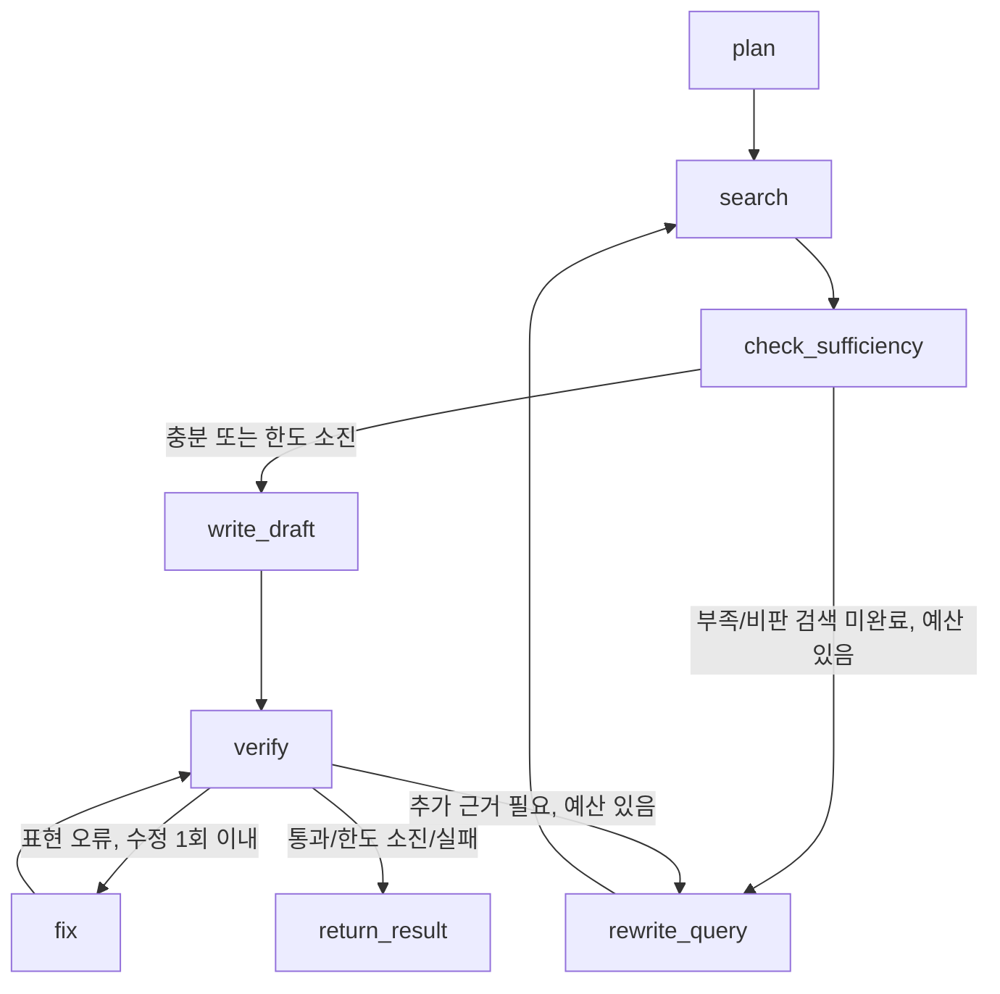

# 구현 범위와 설계 선택

## 공유 자료와의 관계

팀이 공유한 설계 PDF와 초기세팅 ZIP에서 기술 선택(KIVI/ITME), 클라우드 도메인,
LangGraph 역할, BGE-M3/FAISS, 기본 모델과 State 결과 키를 계승했습니다.
계약 v2는 제출 설계의 공통 State·8단계 서브그래프·등급·보고서 검사를 반영합니다. [정합성 변경표](design-alignment.md)의 남은 범위 결정을 함께 읽으세요.

- 적용: 기술 뒤 시장·이해관계자·도메인 병렬 평가, 합류 뒤 종합·보고서 구성
- 적용: 기술·시장·도메인의 논문 RAG, 시장·이해관계자·도메인의 웹 근거
- 적용: 역할별 Jinja2 프롬프트와 rubric, 개인 LangSmith, 고정 근거 단독 테스트
- 적용: 질문별 최대 3회 검색, 실제 인용 검증, 원문 evidence를 보존하는 합류
- 적용: 답변 표현 수정 최대 1회, 질문별 양쪽 검색 계획·충분성 검사·이중언어 재작성
- 적용: 종합 뒤 보완 재실행 1라운드 (`supplement=1`, 설계서 표 13). gaps 의 담당 역할만 재실행하고 synthesis 로 직접 복귀. mock 은 건너뜀
- 적용: SUMMARY–REFERENCE PDF 출력과 그래프 내 인용·형식 검사
- 미완성: 평가 조건 해석 합의, 검색 품질 평가셋/실측, 최종 보고서의 실제 내용 검수

기본 rubric은 팀이 기준 정의를 편집할 출발점입니다. 교수님이 확정한 기준이나 자동 TRL 점수표가 아닙니다.
근거 개수로 시장성을 판정하거나 확인 불가를 최하점으로 치환하지 않습니다.
기존 ZIP의 미검증 평가셋·성능 수치·예시 보고서는 검증된 결과로 이관하지 않았습니다.

## 노드 내부 흐름

fixture/mock은 고정 근거를 한 번만 조회합니다. 실제 모드의 planner는 질문별 긍정·비판 검색어를 이중언어로 작성하고, 충분성 및 인용 Judge 피드백으로 재작성합니다.
표현 오류는 같은 근거만 사용해 최대 1회 수정한 뒤 반드시 재검증합니다. API/파싱 오류는 failed이며 검색 실패 이력도 보존합니다.

전체 live에서 논문 임베더와 FAISS는 한 번 로드해 공유하고 임베딩 호출은 lock으로 보호합니다.
각 병렬 노드가 같은 State 필드를 덮어쓰지 않도록 결과 슬롯을 분리했습니다.
추적에는 그래프 단계, LLM 입력/출력, retriever 결과가 연결되며 실행별 UUID를 사용합니다.

## 검색 구현

- `EvidenceSource.search(Question, attempt) -> list[Evidence]` 계약으로 고정 근거·논문·웹을 교체합니다.
- 문서 목록/판본 내용/청킹 설정/모델 설정을 hash해 오래된 인덱스 사용을 막습니다.
- PDF 물리 페이지 경계를 유지한 1,200자/200자 overlap 청킹입니다. 표·수식·그림·OCR 복원은 하지 않습니다.
- PDF 전체 페이지는 200 이하. 기본 본문 범위는 공유 ZIP의 KIVI 1–9, ITME 1–11을 계승했습니다.
- 모델의 resolved revision과 FAISS/메타데이터 hash를 인덱스 manifest에 남깁니다.
- 서비스 기본값은 BGE-M3 dense + FAISS입니다. 별도 평가 실행기에 learned sparse RRF 실험 경로가 있고 결과를 자동 배포하지 않습니다.
- 작은 수업 corpus를 전제로 전체 후보에서 기술/문서 역할 필터를 적용한 뒤 top-k를 선택합니다.
- 기술/도메인은 해당 기술 target만, 시장은 target+reference, 이해관계자는 경쟁 진영 질문에 한해 reference를 허용합니다.
- 선택적 reranker의 성능·메모리 요구·판본은 아직 측정하지 않았습니다. 기본값은 꺼짐입니다.
- 웹은 Tavily가 반환한 raw_content만 evidence로 사용하고 URL/수집 시각을 남깁니다. 원문 없는 snippet은 제외합니다.

인용 Judge는 evidence에 대한 claim 정합성을 확인합니다. 외부 진실 검증, 기준 등급의 타당성,
웹 검색의 균형성, 모든 요약 문장의 정확성을 보장하지 않습니다. 최종 평가에는 팀원의 원문 검토가 필요합니다.

## 운영 범위

이 환경은 로컬 CLI와 GitHub CI용입니다. 서버 배포, UI, 지속 체크포인트, 사용자 인증은 구현하지 않았습니다.
개인 실행 결과와 키는 공유하지 않으며 Git에는 재현 가능한 코드·프롬프트·fixture·lock만 올립니다.
공통 코드와 라이브러리 업그레이드는 기반 담당자 중심으로, 프롬프트/자료 보강은 노드 담당자 중심으로 진행합니다.

설정/추적 방식은 [LangGraph tracing](https://docs.langchain.com/langsmith/trace-with-langgraph),
[구조화 출력](https://docs.langchain.com/oss/python/langchain/structured-output),
[uv 프로젝트 안내](https://docs.astral.sh/uv/guides/projects/)를 참고했습니다.
