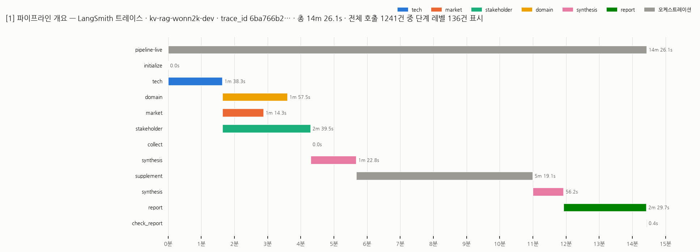

# LangSmith 트레이스 워터폴 이미지

2026-10-07 live 전체 실행의 **LangSmith 실제 트레이스**를 API로 받아 워터폴로 렌더링한 것이다.
progress 로그나 파일 시각으로 로컬에서 재구성한 추정치가 아니다.

| 항목 | 값 |
|---|---|
| LangSmith 프로젝트 | `kv-rag-wonn2k-dev` |
| trace_id | `6ba766b2-510a-4f3a-9945-c7da781ed6a9` |
| 실행 리비전 | `2a7e52c` — feat/supervisor-multi-agent 최신(#41·#42 포함) + 조판 수정 병합 |
| 모드 / 총 시간 | live / 14m 26s |
| 추적된 호출 수 | 1,241건 (노드·단계·LLM·검색 호출 전부) |
| 원본 UI | 실행 산출물 `run.json`의 `trace_url` (LangSmith 웹에서 같은 trace_id 확인 가능) |

## 만든 방법

1. **추적을 켜고 실행**: `.env`는 그대로 두고 환경변수로만
   `LANGSMITH_TRACING=true LANGSMITH_PROJECT=kv-rag-wonn2k-dev ./run-report.sh` 를 실행했다.
   runner가 추적을 감지하면 종료 시 `run.json`에 `trace_url`을 기록한다.
2. **트레이스 수집**: `langsmith` SDK(`Client.list_runs`)로 루트 실행의 `trace_id`에 속한
   전체 run tree 1,241건을 받았다. 각 run의 이름·부모·시작/종료 시각·오류 여부를 쓴다.
3. **렌더링**: matplotlib + 저장소의 NanumGothic(`assets/fonts/`)으로 수평 막대 워터폴을 그렸다.
   - 깊이 3(단계 레벨: plan / search / check_sufficiency / write_draft / verify / fix /
     rewrite_query / return_result)까지만 표시하고, 그 아래 개별 LLM·검색 호출(1,100여 건)은
     건수로만 제목에 남겼다. LangSmith UI에서 두 단계 펼친 화면과 같은 수준이다.
   - 42행을 넘으면 장을 나눴다(개요 1장 + 상세 4장).
   - 색은 "등수"가 아니라 "개체"를 따른다: 노드 6종(tech·market·stakeholder·domain·
     synthesis·report)에 고정 슬롯을 배정했고(범주형 팔레트, CVD 분리 검증 통과),
     initialize·collect·supplement 같은 오케스트레이션 단계는 중립 회색이다.
     모든 행에 이름과 소요 시간을 잉크색 텍스트로 직접 표기해 색에만 의존하지 않는다.

렌더링 스크립트는 일회성 보조 도구라 저장소에 넣지 않았다(필요하면 PR로 추가).
같은 trace_id로 LangSmith UI에서 언제든 동일한 내용을 다시 볼 수 있다.

## 결과가 보여주는 것

**개요(1장)** — 설계대로 흐른 실행 구조가 그대로 보인다.

| 구간 | 소요 | 비고 |
|---|---|---|
| tech | 1m 38s | 단독 선행 |
| domain / market / stakeholder | 1m 58s / 1m 14s / 2m 40s | tech 종료 직후 **병렬** 실행 |
| synthesis (1차) | 1m 23s | |
| supplement | 5m 19s | 전체 14.4분의 37% |
| synthesis (2차) | 56s | 보완 뒤 재종합 |
| report + check_report | 2m 30s + 0.4s | |

이전 리비전(`4b8f42a`, 083abcd 기반)의 트레이스에서는 supplement가 11m 35s로 전체의
46%였다. 코디네이션 레이어 수정(94e41a8·d2594d9)이 반영된 이번 리비전에서 5m 19s로
줄었다. 실행마다 검색·재시도 횟수가 달라 1회 실측끼리의 비교이므로 단정은 하지 않지만,
여전히 supplement가 단일 구간으로는 가장 길다.

**상세(2~5장)** — 단계 레벨 136건의 워터폴.
`trace-02`: 첫 패스. tech의 verify→fix 재시도, 세 평가 노드의 plan→search→
check_sufficiency→(rewrite_query→search 반복)→write_draft→verify 루프가 시간축 위에
그대로 찍혀 있다. `trace-03~04`: supplement 구간의 재실행. `trace-05`: 2차 synthesis와
report 생성.

## 주의

- 이 이미지는 **시간·호출 구조의 기록**이다. 판정 품질이나 검증 결과(해당 실행은
  `needs_revision`)는 실행 산출물 JSON과 보고서가 따로 담는다.
- 호출 수·시간은 이 한 번의 실행 값이며, 검색 결과와 재시도 횟수에 따라 실행마다 달라진다.
